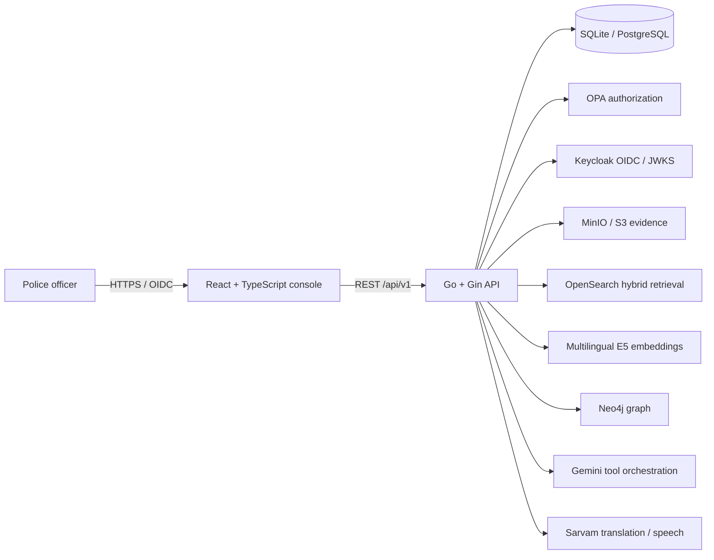

<p align="center">
  
</p>

<p align="center">
  <strong>A secure, Kannada-capable FIR operations and explainable crime-intelligence platform for police investigation teams.</strong>
</p>

<p align="center">
  
  
  
  
  
</p>

---

## ICCAP at a glance

ICCAP—the **Intelligent Conversational AI & Crime Analytics Platform**—brings FIR registration, case records, investigation tasks, evidence handling, crime analytics, criminal relationships and a governed AI copilot into one jurisdiction-aware police workspace.

Its central promise is simple:

> Turn fragmented FIR records into explainable, Kannada-accessible investigation intelligence without weakening evidence integrity or police access controls.

ICCAP is a decision-support platform. It does not replace investigating officers, supervisors, courts, legal review or official departmental procedure.

## Problems addressed

| Police pain point | ICCAP response |
|---|---|
| Case information is scattered across different records | One case workspace for FIR facts, parties, legal sections, arrests, chargesheet, evidence, timeline, tasks and related cases |
| Investigations are delayed without clear ownership | Readiness checks, missing-action detection, assigned tasks, priorities, deadlines and completion history |
| Relationships across FIRs are difficult to discover | Similar-case matching, repeat-offender analysis and co-accused relationship graphs |
| Officers spend too much time manually searching | Structured FIR search, multilingual hybrid retrieval and an allowlisted AI investigation copilot |
| Indian-language interaction is limited | Kannada/English translation, Kannada voice transcription and localized AI responses |
| AI answers can be opaque or unsafe | Grounded tool results, citations, confidence, response hashes, redactions and evidence trails |

## Distinctive capabilities

- **Kannada-first investigation assistance:** typed or spoken Kannada queries can be translated, transcribed and answered using authorized police records.
- **Evidence-grounded AI:** the model cannot execute unrestricted SQL or invent its own jurisdiction; it selects from a server-side tool allowlist.
- **Case readiness scoring:** checks chronology, location, narrative completeness, parties, legal sections, occurrence data and evidence metadata.
- **Explainable case connections:** matches FIRs using crime heads, shared sections, narrative/modus-operandi similarity and geographic distance, with reasons for every match.
- **Accountable action centre:** turns advisory missing actions into assigned work with an officer, priority, deadline, status and append-only task history.
- **Evidence integrity:** records SHA-256 hashes, protected object-storage references, classifications, access events and custody history.
- **Jurisdiction-safe access:** unit, district, rank and role claims are enforced by backend authorization—not trusted from browser input.

## Product features

### FIR and case operations

- Structured, multi-step FIR registration
- Atomic police-station/category/year FIR numbering
- Case search, filters, status management and timeline
- Editable complainant, victim and accused records
- Arrest and surrender events linked to accused persons
- Applicable acts and legal sections
- A/B/C chargesheet and final-report management
- Unit-scoped employee directory

### Investigation management

- Case-readiness score and corrective checklist
- Pending-case prioritization based on age, gravity and missing work
- Officer assignment and task reassignment
- Low, medium, high and critical priorities
- Deadlines, blocked/in-progress/completed states and completion notes
- Append-only task event history

### Evidence management

- S3-compatible/MinIO evidence upload
- Original filename, MIME type, size, language and PII classification
- Authenticated preview and download
- SHA-256 integrity digest
- Upload, access and classification custody events
- Role-aware evidence access

### Search, analytics and graph intelligence

- Structured relational search
- OpenSearch BM25 + multilingual E5 vector hybrid search
- Burglary hotspot activity
- Similar-FIR ranking
- Repeat-offender analysis
- Co-accused network exploration
- Optional Neo4j case/accused graph synchronization

### Governed AI copilot

- Gemini tool orchestration with structured function calls
- Kannada–English translation through Sarvam Mayura
- Kannada/Indian-language speech transcription through Sarvam Saaras
- Deterministic allowlisted fallback when external inference is unavailable
- Session history and audited PDF export
- Citations, confidence, tool/result identifiers, response hash and redaction log

## Architecture



The backend follows handler → service → repository boundaries. Sensitive scope is derived from verified authentication claims and injected server-side into database, analytics and AI tool operations.

## Technology stack

| Layer | Technology |
|---|---|
| Web application | React, TypeScript, Vite, React Router, Lucide icons |
| API | Go 1.26, Gin |
| Data access | GORM |
| Development database | SQLite |
| Production databases | PostgreSQL or MySQL |
| Identity | Local JWT for development; Keycloak OIDC/JWKS for deployment |
| Authorization | Backend unit/rank checks and optional Open Policy Agent |
| Reasoning/orchestration | Gemini Flash through the official Gemini REST API |
| Translation and speech | Sarvam Mayura and Saaras |
| Embeddings | `intfloat/multilingual-e5-base` through Text Embeddings Inference |
| Retrieval | OpenSearch hybrid keyword/vector search |
| Evidence storage | MinIO or another S3-compatible object store |
| Graph intelligence | Neo4j |
| Local infrastructure | Docker Compose |

## Repository layout

```text
Police-Crime-Data-Os/
├── backend/
│   ├── cmd/server/             # API entry point and dependency wiring
│   ├── internal/
│   │   ├── config/             # Environment configuration
│   │   ├── database/           # SQLite/PostgreSQL/MySQL connection
│   │   ├── handlers/           # HTTP request handlers
│   │   ├── middleware/         # JWT, OIDC, OPA, CORS, audit and rate limits
│   │   ├── models/             # FIR ER model and platform extensions
│   │   ├── repositories/       # Scoped database operations
│   │   ├── services/           # Intelligence, AI, search, storage and graph logic
│   │   └── utils/              # API responses and PDF generation
│   └── migrations/             # Versioned PostgreSQL production DDL
├── frontend/
│   ├── src/components/         # Shell and reusable investigation panels
│   ├── src/pages/              # Dashboard, cases, copilot and intelligence views
│   ├── src/lib/                # API and OIDC/PKCE clients
│   └── src/state/              # Authentication state
├── deploy/dev/
│   ├── docker-compose.infrastructure.yml
│   ├── keycloak/               # Development realm import
│   └── opa/                    # Authorization policy and tests
└── docs/                       # Security, setup and completion documentation
```

## Installation: fast local setup

This setup uses SQLite and local JWT authentication. It does not require Docker, Gemini, Sarvam, OpenSearch, MinIO or Neo4j.

### Prerequisites

- Git
- Go `1.26.4` or a compatible Go `1.26.x` toolchain
- Node.js `22+` and npm

### 1. Clone

```bash
git clone https://github.com/Sarthak702-droid/Police-Crime-Data-Os.git
cd Police-Crime-Data-Os
```

### 2. Build the frontend

```bash
cd frontend
npm ci
npm run build
cd ..
```

The Go server detects `frontend/dist` and serves the complete web application from the same origin.

### 3. Configure the backend

```bash
cd backend
cp .env.example .env
```

For the basic local configuration, keep:

```env
PORT=8002
ENV=development
DB_DIALECT=sqlite
DB_NAME=police_fir.db
AUTH_MODE=local
AI_ENABLED=false
```

Generate a local JWT secret and place it in `.env`:

```bash
openssl rand -hex 32
```

The application reads operating-system environment variables. Load `.env` into the current shell before starting it:

```bash
set -a
source .env
set +a
```

### 4. Run

```bash
go mod download
go run ./cmd/server
```

Open:

```text
http://localhost:8002
```

When a new development database is created, the seed login is:

```text
KGID: KG12345
Password: password
```

The demo password is development-only and must never be used in a deployed environment.

## Frontend hot-reload development

Run the backend on `8002`, then open another terminal:

```bash
cd frontend
cp .env.example .env
npm run dev
```

Open `http://localhost:5173`. Vite proxies `/api` to `http://localhost:8002`.

## Full infrastructure setup

The development Compose stack includes OpenSearch, MinIO, Neo4j, Keycloak, OPA and an optional multilingual E5 embedding service.

### 1. Configure infrastructure secrets

```bash
cd deploy/dev
cp .env.infrastructure.example .env.infrastructure
```

Replace every `replace_with_high_entropy_password` value. Then start the services:

```bash
docker compose \
  --env-file .env.infrastructure \
  -f docker-compose.infrastructure.yml \
  --profile ai up -d
```

### 2. Service addresses

| Service | Address |
|---|---|
| OpenSearch | `http://127.0.0.1:9200` |
| MinIO API | `http://127.0.0.1:9000` |
| MinIO console | `http://127.0.0.1:9001` |
| Neo4j HTTP | `http://127.0.0.1:7474` |
| Neo4j Bolt | `bolt://127.0.0.1:7687` |
| Keycloak | `http://127.0.0.1:8081` |
| OPA | `http://127.0.0.1:8181` |
| Multilingual E5 | `http://127.0.0.1:8082` |

### 3. Enable backend adapters

From `backend/`, configure `.env` using new credentials:

```env
EMBEDDING_BASE_URL=http://127.0.0.1:8082
SEARCH_BASE_URL=http://127.0.0.1:9200
SEARCH_INDEX=police-cases

OBJECT_STORAGE_ENDPOINT=http://127.0.0.1:9000
OBJECT_STORAGE_ACCESS_KEY=<MINIO_ROOT_USER>
OBJECT_STORAGE_SECRET_KEY=<MINIO_ROOT_PASSWORD>
OBJECT_STORAGE_BUCKET=police-evidence

GRAPH_BASE_URL=http://127.0.0.1:7474
GRAPH_USERNAME=neo4j
GRAPH_PASSWORD=<NEO4J_PASSWORD>

OPA_URL=http://127.0.0.1:8181/v1/data/police/authz/allow
```

Reload the environment and restart the backend.

## Enabling AI, Kannada and speech

Never put provider keys in frontend variables or commit them to Git.

```env
AI_ENABLED=true
AI_PROVIDER=gemini
AI_BASE_URL=https://generativelanguage.googleapis.com/v1beta
AI_MODEL=gemini-3.5-flash
AI_API_KEY=<new Gemini API key>

TRANSLATION_BASE_URL=https://api.sarvam.ai
SARVAM_API_KEY=<new Sarvam API key>
```

Rotate any credential that has appeared in source code, terminal output, screenshots or chat history before using it.

If AI is disabled or a provider call fails, the backend retains a deterministic allowlisted tool router for supported police queries.

## Authentication modes

### Local JWT

Use for isolated development:

```env
AUTH_MODE=local
```

### Keycloak OIDC

Use the imported `police-intelligence` realm and public `crime-api` client:

```env
AUTH_MODE=oidc
OIDC_ISSUER=http://127.0.0.1:8081/realms/police-intelligence
OIDC_AUDIENCE=crime-api
OIDC_JWKS_URL=http://127.0.0.1:8081/realms/police-intelligence/protocol/openid-connect/certs
```

Frontend configuration:

```env
VITE_AUTH_MODE=oidc
VITE_OIDC_ISSUER=http://localhost:8081/realms/police-intelligence
VITE_OIDC_CLIENT_ID=crime-api
```

Rebuild the frontend after changing any `VITE_*` value.

## Database configuration

Supported dialects:

```env
DB_DIALECT=sqlite    # local default
DB_DIALECT=postgres  # recommended production database
DB_DIALECT=mysql
```

For PostgreSQL:

```env
DB_DIALECT=postgres
DB_HOST=127.0.0.1
DB_PORT=5432
DB_NAME=police_fir
DB_USER=postgres
DB_PASSWORD=<database password>
DB_SSLMODE=require
```

The backend performs GORM auto-migration for development. Production deployments should use the ordered migrations:

1. `backend/migrations/001_production_hardening.sql`
2. `backend/migrations/002_investigation_workspace.sql`

Back up the target database before applying production migrations.

## API overview

All API routes use the `/api/v1` prefix. Except login and token refresh, routes require `Authorization: Bearer <token>`.

| Area | Representative endpoints |
|---|---|
| Authentication | `POST /auth/login`, `POST /auth/refresh`, `GET /auth/me` |
| FIR cases | `POST /cases`, `GET /cases/search`, `GET /cases/:id`, `GET /cases/:id/timeline` |
| Parties | `GET/POST/PATCH` complainants, victims and accused under `/cases/:id` |
| Legal/custody | arrests, chargesheet, acts and legal sections under `/cases/:id` |
| Investigation tasks | `/cases/:id/tasks`, task history and `/investigation/tasks` |
| Evidence | upload, metadata, content and custody history under `/cases/:id/evidence` |
| Analytics | hotspots, readiness, similar cases and pending actions under `/analytics` |
| Retrieval | `GET /search/hybrid`, `POST /search/cases/:id/index` |
| Graph | `GET /graph/subgraph`, `POST /graph/cases/:id/sync` |
| AI | `POST /chat/query`, `GET /ai/tools`, translation and speech-to-text |
| Conversation audit | sessions, turns, evidence trails and PDF export |

Successful response envelope:

```json
{
  "success": true,
  "message": "Request completed",
  "data": {}
}
```

See [backend/README.md](backend/README.md) for endpoint examples and [docs/integrations-setup.md](docs/integrations-setup.md) for provider-specific configuration.

## Testing and quality checks

Backend:

```bash
cd backend
go test ./...
go test -race ./...
go vet ./...
```

Frontend:

```bash
cd frontend
npm ci
npm run lint
npm run build
```

Infrastructure configuration:

```bash
cd deploy/dev
docker compose \
  --env-file .env.infrastructure.example \
  -f docker-compose.infrastructure.yml \
  config --quiet
```

## Security model

- JWT validation restricts accepted algorithms; OIDC mode validates issuer, audience, expiry, key ID and RS256 signatures.
- JWKS keys are cached and refreshed for signing-key rotation.
- Unit and district scope come from verified claims rather than request bodies.
- OPA can enforce investigator, supervisor and administrator policies.
- Role hierarchy controls sensitive person-data redaction.
- Login, chat, translation and speech endpoints are rate-limited.
- Audit events and AI evidence trails preserve request/action provenance.
- Refresh tokens are stored as SHA-256 digests.
- Evidence objects are accessed through authenticated API endpoints.
- API keys, `.env` files, databases, object-store data, compiled binaries and generated builds are excluded from Git.

Review [docs/security-work-summary.md](docs/security-work-summary.md) for the security assessment and remaining production controls.

## Production checklist

Before deployment:

- Use PostgreSQL with encrypted connections and managed backups.
- Put all credentials in a secret manager; never bake them into images or frontend assets.
- Terminate HTTPS at a trusted reverse proxy or load balancer.
- Enable Keycloak OIDC and OPA fail-closed authorization.
- Enable OpenSearch security instead of the development security-disabled configuration.
- Configure immutable/versioned evidence storage and documented retention rules.
- Pin container images by tested version or digest.
- Add centralized logs, metrics, alerting and SIEM integration.
- Define database, object-store and graph backup/restore exercises.
- Complete privacy, legal, model-risk and open-source license reviews.
- Perform threat modelling, penetration testing and operational acceptance with police stakeholders.

## Troubleshooting

### `404 page not found` on port 8002

Build the frontend before starting the backend:

```bash
cd frontend && npm run build
cd ../backend && go run ./cmd/server
```

If another process owns the port:

```bash
lsof -nP -iTCP:8002 -sTCP:LISTEN
fuser -k 8002/tcp
```

### Blank browser page

Rebuild, restart, then open a cache-busted URL:

```text
http://127.0.0.1:8002/?v=2
```

Use `Ctrl+Shift+R` for a hard refresh.

### Backend ignores `.env`

Load it into the shell before `go run`:

```bash
set -a; source .env; set +a
```

### `address already in use`

Stop the existing server with `Ctrl+C` or:

```bash
fuser -k 8002/tcp
```

### Optional feature reports “unavailable”

Routes for object storage, hybrid retrieval and graph synchronization are registered only when their required backend configuration is present. Start the corresponding service, load `.env`, and restart the backend.

## Documentation

- [Backend API guide](backend/README.md)
- [Frontend guide](frontend/README.md)
- [Integration setup](docs/integrations-setup.md)
- [Backend/database/AI completion notes](docs/backend-db-ai-completion.md)
- [Security work summary](docs/security-work-summary.md)

## Responsible-use notice

ICCAP processes highly sensitive law-enforcement information. Deploy it only under an approved legal basis, documented access policy, evidence-retention procedure and incident-response plan. AI scores, similarity results and generated answers are advisory; authorized officers and supervisors retain responsibility for every operational and legal decision.
